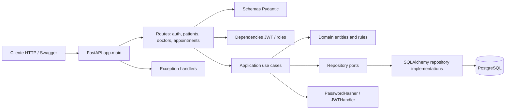

# Arquitectura del Sistema

## Arquitectura general

El proyecto implementa una arquitectura por capas cercana a Clean Architecture. La aplicacion separa la exposicion HTTP, los casos de uso, el dominio y la infraestructura.

```text
app/
├── adapters/          # Entrada HTTP: rutas, schemas y dependencias
├── application/       # Casos de uso, DTOs y puertos
├── domain/            # Entidades, value objects y excepciones
└── infrastructure/    # Base de datos, repositorios, seguridad y configuracion
```

## Componentes

| Capa | Responsabilidad | Archivos principales |
| --- | --- | --- |
| Adapters HTTP | Expone endpoints FastAPI, valida request/response con Pydantic y aplica dependencias de seguridad. | `app/adapters/http/routes/*`, `schemas/*`, `dependencies.py` |
| Application | Orquesta reglas de aplicacion mediante casos de uso. | `app/application/use_cases/*` |
| Domain | Contiene entidades puras, reglas de negocio y excepciones. | `app/domain/entities/*`, `value_objects/*`, `exceptions/*` |
| Infrastructure | Implementa persistencia, seguridad, configuracion y repositorios. | `app/infrastructure/persistence/*`, `security/*`, `config/*` |
| Main | Crea la instancia FastAPI, registra routers, CORS y handlers. | `app/main.py` |

## Flujo de datos

1. El cliente realiza una peticion HTTP a un endpoint FastAPI.
2. El schema Pydantic valida los datos de entrada.
3. Las dependencias verifican token JWT y rol cuando aplica.
4. La ruta construye un DTO y llama al caso de uso correspondiente.
5. El caso de uso aplica reglas de negocio y consulta repositorios.
6. El repositorio usa SQLAlchemy async para acceder a PostgreSQL.
7. El resultado vuelve como DTO y se serializa como response Pydantic.
8. Las excepciones de dominio se traducen a codigos HTTP mediante handlers centralizados.

## Diagrama Mermaid



## Frontend

No se encontro frontend dentro del repositorio. No existen carpetas ni archivos React, como `package.json`, `src`, `components`, `pages`, `.jsx` o `.tsx`.

La API deja CORS configurado para:

- `allow_origins=["*"]` cuando `DEBUG=True`.
- `allow_origins=["http://localhost:5173"]` cuando `DEBUG=False`.

Esto sugiere una posible integracion futura con un frontend local en Vite, pero ese frontend no esta implementado en este repositorio.

## Backend

El backend esta construido con FastAPI. El punto de entrada es `app/main.py`, donde se configura:

- Nombre y version desde variables de entorno.
- Documentacion interactiva en `/docs`.
- ReDoc en `/redoc`.
- CORS.
- Handlers de excepciones.
- Routers bajo el prefijo `/api/v1`.
- Endpoint de salud `/health`.

## Base de datos

La persistencia usa SQLAlchemy async con `asyncpg`. El engine se crea en `app/infrastructure/persistence/database.py` usando `DATABASE_URL`.

Modelos SQLAlchemy identificados:

| Tabla | Modelo | Proposito |
| --- | --- | --- |
| `users` | `UserModel` | Credenciales, rol y estado de usuario. |
| `patients` | `PatientModel` | Perfil de paciente. |
| `doctors` | `DoctorModel` | Perfil medico. |
| `doctor_availability` | `DoctorAvailabilityModel` | Disponibilidad semanal del medico. |
| `appointments` | `AppointmentModel` | Citas medicas. |

## APIs

La API esta organizada en cuatro routers:

- `/api/v1/auth`
- `/api/v1/patients`
- `/api/v1/doctors`
- `/api/v1/appointments`

Adicionalmente existe `/health` fuera del prefijo `/api/v1`.

## Autenticacion y autorizacion

La autenticacion usa JWT:

- El login valida usuario y contrasena.
- El token incluye `sub` con el ID de usuario y `role`.
- Los endpoints protegidos usan `HTTPBearer`.
- Los roles identificados son `admin`, `doctor` y `patient`.

Restricciones observadas:

| Dependencia | Acceso |
| --- | --- |
| `get_current_user` | Cualquier usuario autenticado. |
| `require_admin` | Solo rol admin. |
| `require_doctor` | Solo rol doctor. |
| `require_admin_or_doctor` | Rol admin o doctor. |

